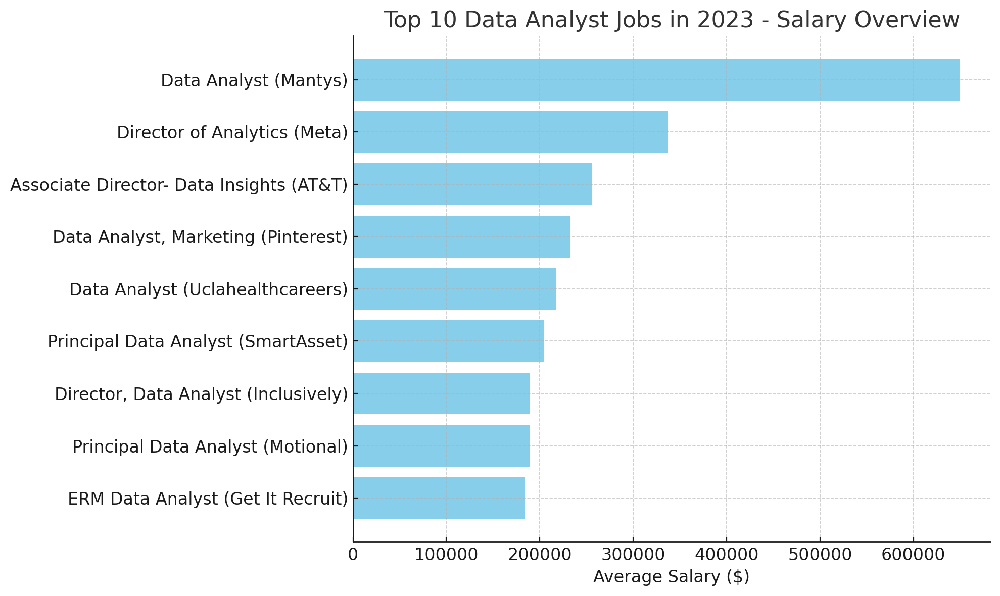
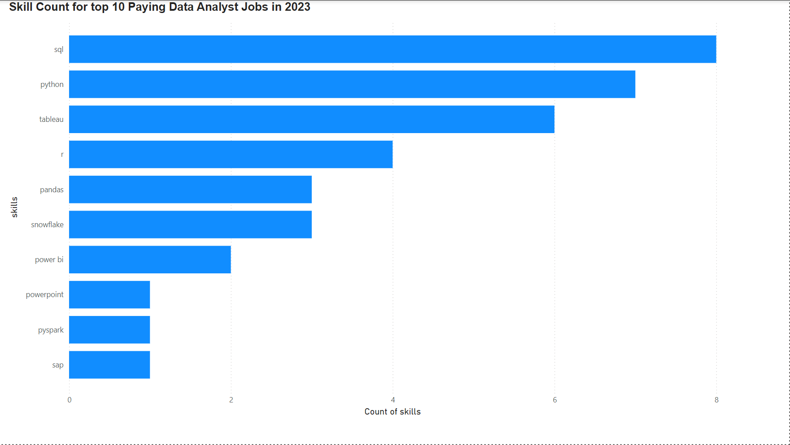
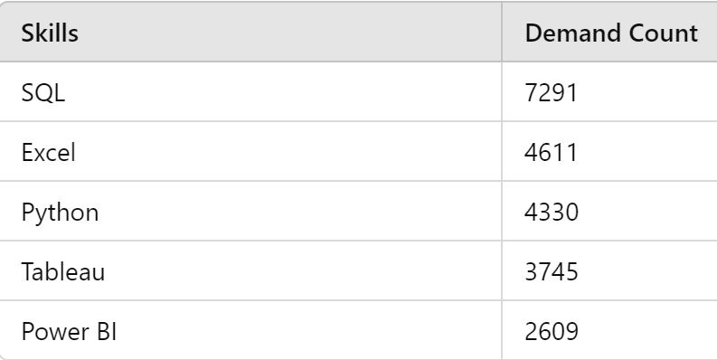
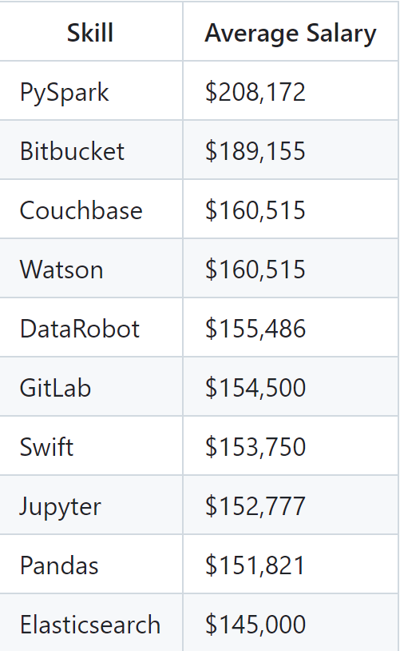

# Introduction
Get insight on the Data job market. Emphasizing Analyst roles, this project explores the top paying jobs, in demand skills, and the cross section between demand and high salary for Data Analytics

SQL queries? Check them out here: [project_sql folder](/project_sql/)

# Background
As someone new to the analytics market, navigating which skills to learn can be quite overwhelming. This project came to life as a method of identifying top-paid and in-demand skills

### The questions I wanted to answer through my SQL queries were: 

1. What are the top paying dat analyst jobs?
2. What skills are required for these top-paying jobs?
3. What skills are most in demand for data analysts?
4. which skills are associated with higher salaries?
5. What are the most optimal skills to learn?

# Tools I used
During my process of delving into the Data Analyst job market I used several key tools:

- **SQL**: The was the foundation that allowed me to create queries on my database and make important insights 

- **PostgresSQL**: The chosen database system, which was ideal for handling my job posting data.

- **Visual Studio Code**: What has become my go-to for database management and executing of SQL queries

- **Git & Github**: Essential for sharing my SQL scripts and analysis, allowing for others to see my work

# The Analytics
For this project, each query was designed with a specific goal in mind relating to the Data Analyst Job Market. Here were my approaches:

### 1. Top Paying Data Analyst Jobs (Remote) ###

To identify the highest-paying roles, I filtered the data analyst positions by average yearly salary and location, with an emphasis on remote jobs. This query highlights the top 10 highest paying opportunities using the aformentioned metrics 

```sql
SELECT
    job_id,
    job_title,
    job_location,
    job_schedule_type,
    salary_year_avg,
    job_posted_date,
    name AS company_name
FROM
    job_postings_fact
LEFT JOIN company_dim
    ON job_postings_fact.company_id = company_dim.company_id
WHERE
    job_title_short = 'Data Analyst' AND
    job_location = 'Anywhere' AND
    salary_year_avg IS NOT NULL
ORDER BY
    salary_year_avg DESC
LIMIT 10;
```

The dataset reveals that the highest paying role is a "Data Analyst" at Mantys, offering an impressive annual salary of $650,000, far exceeding the rest of the positions. Leadership roles, such as the "Director of Analytics" at Meta and the "Director, Data Analyst - HYBRID" at Inclusively, also offer competitive salaries of $336,500 and $189,309, respectively, showcasing the high earning potential for director-level positions. 

Several principal-level data analyst roles, like those at SmartAsset and Motional, offer salaries ranging from $184,000 to $205,000, indicating strong compensation for senior data positions. Standard data analyst roles, such as those at UCLA Healthcare Careers and Pinterest, are also well-compensated, with salaries hovering between $217,000 and $232,423, especially for remote or hybrid work opportunities. 

Overall, the data highlights significant salary variation, with high pay associated with leadership, seniority, and remote flexibility.



*Bar graph visualizing the salary for the top 10 Data Analyst positions; Chat gpt generated this graph from my SQL query results*

### 2. Top Paying Data Analyst Jobs (Remote) ###
Building on the prewvious query, I joined the job postings data with the skills data to analyse what skills are required for these top-paying jobs. _Important note - The data given from this query excludes the two highest paying jobs because the skills were not listed(i.e. NULL values)


```SQL
WITH top_paying_jobs AS (
    SELECT job_id,
        job_title,
        salary_year_avg,
        name AS company_name
    FROM job_postings_fact
        LEFT JOIN company_dim ON job_postings_fact.company_id = company_dim.company_id
    WHERE job_title_short = 'Data Analyst'
        AND job_location = 'Anywhere'
        AND salary_year_avg IS NOT NULL
    ORDER BY salary_year_avg DESC
    LIMIT 10
)
    SELECT 
    top_paying_jobs.*,
    skills
    FROM top_paying_jobs
INNER JOIN skills_job_dim ON top_paying_jobs.job_id = skills_job_dim.job_id
INNER JOIN skills_dim ON skills_job_dim.skill_id = skills_dim.skill_id
ORDER BY 
    salary_year_avg DESC
```


*Bar graph visualizing the skill count for the top 10 paying data analyst roles*

### 3. In demand skills for Data Analysts ###
This query identifies the top 10 most frequently requested skills in job postings
```sql
SELECT 
    skills,
    COUNT(skills_job_dim.job_id) AS demand_count
FROM job_postings_fact
INNER JOIN skills_job_dim ON job_postings_fact.job_id = skills_job_dim.job_id
INNER JOIN skills_dim ON skills_job_dim.skill_id = skills_dim.skill_id
WHERE 
    job_title_short = 'Data Analyst' AND
    job_work_from_home = TRUE
GROUP BY 
    skills
ORDER BY
    demand_count DESC
LIMIT 5
```
SQL is the most in demand skill, followed by Excel, Python, Tableau, and Power BI


### 4. Top Paying Data Analyst Jobs (Remote) ###
This query calculates the average salary for each skill to identify which skills offer the highest pay
```sql
SELECT 
    skills,
    ROUND(AVG(salary_year_avg),0) AS avg_salary_yearly
FROM job_postings_fact
INNER JOIN skills_job_dim ON job_postings_fact.job_id = skills_job_dim.job_id
INNER JOIN skills_dim ON skills_job_dim.skill_id = skills_dim.skill_id
WHERE 
    job_title_short = 'Data Analyst' AND
    salary_year_avg iS NOT NULL AND
    job_work_from_home = TRUE
GROUP BY 
    skills
ORDER BY
    avg_salary_yearly DESC
LIMIT 25
```
Here's a breakdown of the top-paying skils for data analysts:



*Keep in mind: Although skills like Bitbucket,Couchbase, and Watson are high-paying they dont typically have a direct relation to daily Data Analyst functions compared to the other skills listed*

### 5. Top Paying Data Analyst Jobs (Remote) ###
By analyzing both demand and salary data, this query identifies skills that are in the greatest demand while offering a high salary, in order to provide a strategic focus on skill development 

```SQL
SELECT
    skills_dim.skill_id,
    skills_dim.skills,
    COUNT(skills_job_dim.job_id) AS demand_count,
    ROUND(AVG(job_postings_fact.salary_year_avg),0) AS avg_salary
FROM job_postings_fact
INNER JOIN skills_job_dim ON job_postings_fact.job_id = skills_job_dim.job_id
INNER JOIN skills_dim ON skills_job_dim.skill_id = skills_dim.skill_id
WHERE 
    job_title_short = 'Data Analyst' AND
    salary_year_avg IS NOT NULL AND
    job_work_from_home = TRUE
GROUP BY 
    SKILLS_DIM.skill_id
HAVING 
    COUNT(skills_job_dim.job_id) > 10
ORDER BY 
    avg_salary DESC,
    demand_count DESC
LIMIT 25;
```
| skills       | demand_count | avg_salary |
|--------------|--------------|------------|
| go           | 27           | 115320     |
| confluence   | 11           | 114210     |
| hadoop       | 22           | 113193     |
| snowflake    | 37           | 112948     |
| azure        | 34           | 111225     |
| bigquery     | 13           | 109654     |
| aws          | 32           | 108317     |
| java         | 17           | 106906     |
| ssis         | 12           | 106683     |
| jira         | 20           | 104918     |
| oracle       | 37           | 104534     |
| looker       | 49           | 103795     |
| nosql        | 13           | 101414     |
| python       | 236          | 101397     |
| r            | 148          | 100499     |
| redshift     | 16           | 99936      |
| qlik         | 13           | 99631      |
| tableau      | 230          | 99288      |

*Table of the most optimal skills for Data Analysts, sorted by Salary*

Python is the most sought-after skill, with a demand count of 236, showcasing its significance in data analysis, machine learning, and web development.In terms of salary, Go has the highest average at $115,320, reflecting its growing popularity in cloud services and backend development. while Tableau and Looker are in high demand (with counts of 230 and 49), their average salaries of $99,288 and $103,795 indicate that visualization skills may not command as high a salary compared to programming language

### 6. Top Paying Data Analyst Jobs (Remote) ###

This query is similar to the first one just making adjustments to my location in the US!
```sql
SELECT
    job_id,
    job_title,
    job_location,
    job_schedule_type,
    salary_year_avg,
    job_posted_date,
    name AS company_name
FROM
    job_postings_fact
LEFT JOIN company_dim
    ON job_postings_fact.company_id = company_dim.company_id
WHERE
    job_title_short = 'Data Analyst' AND
    job_location = 'San Diego, CA' AND
    salary_year_avg IS NOT NULL
ORDER BY
    salary_year_avg DESC
LIMIT 10;
```

| job_title                                              | salary_year_avg | company_name              |
|-------------------------------------------------------|------------------|---------------------------|
| Perception - Research Engineer/Research Scientist      | 163000.0         | TuSimple                  |
| Data Architect - CA 🏆                               | 137280.0         | Ledgent Technology         |
| Population Health Data Analyst                         | 102500.0         | Spry Methods              |
| Statistician or Senior Statistician-Hybrid            | 83105.0          | UC San Diego Health       |
| CNSP Surface Force Training Requirements and Data Analyst | 51014.0          | Sigma Defense             |

*Chart displaying the highest paying Data Analyst jobs in San Diego, CA in 2023*

The data shows us that there can truly be alot of variation in what a Data analyst is called; you may not be specifically titled as Data Analyst but still perform the same tasks.
# Overall Insights #
1. **Top-Paying Data Analyst Jobs:** The highest-paying jobs for data analysts that allow remote work, the highest at $650,000!
2. **Skills for Top-Paying Jobs:** High-paying data analyst positions demand advanced proficiency in SQL, indicating that this skill is essential for securing a top salary.
3. **Most In Demand Skills:** SQL is the most sought-after skill in the data analyst job market, making it crucial for job seekers.
4. **Skills with Higher Salaries:** Specialized skills like PySpark and Bitbucket are linked to the highest average salaries for data analysts, highlighting the value placed on niche expertise.
5. **Optimal Skills for Job Market Value:** Go ranks highest in both demand and average salary, making it a highly valuable skill for a Data Analyst to learn. However, SQL remains the most in-demand skill overall and still offers a competitive average salary.
6. **Top-Paying Data Analyst Jobs in San Diego,CA:** The top 10 highest paying jobs in Tampa, FL had a salary range of $51K to $163K!

# What I learned #
This project really helped me put all the pieces of analysis in SQL together in a way that makes sense to me personally. I learned...
- How to use PostgresSQL in conjunction with VScode to create and query a local database
- How to apply basic functions to advance functions like (Common Table Expressions) CTE's in a way that simplifies the processees.
- I learned how to upload a my local repository to a remote one on Github
# Conclusions #
This project has taught me alot about the Data Analyst job market and about myself as an aspiring Analyst in the field. There are so many programs to use but as long as you can focus on a few key programs (based on the field you want) you can go farther and feel less overwhelmed in your career. SQL is also an amazing tool that at times feels enjoyable to use because of how you can use it. It really challenges you to think about how you want to analyse data and can feel rewarding when you find what youre looking for.